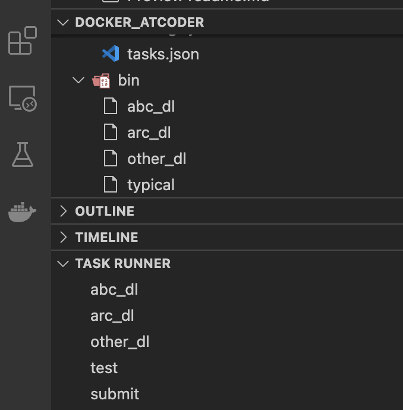
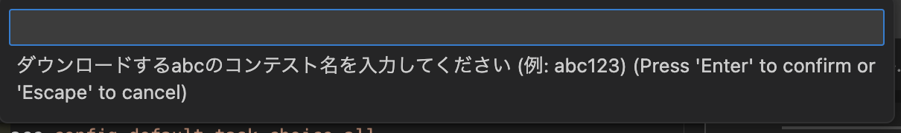
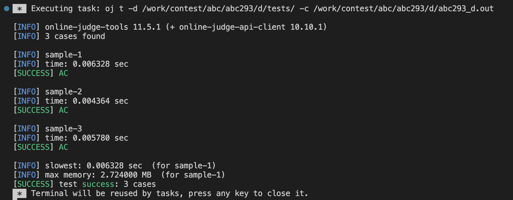
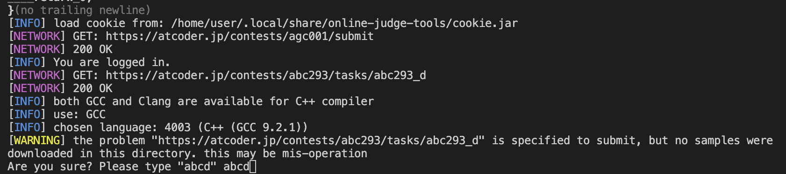

<!-- nodejsをダウンロードしていることでコンテナがでかくなってしまっている -->
<!-- accのインストールにnodejsを使っているが，accはzipファイルからインストールすることも可能 -->
<!-- abc, arc以外のコンテストをotherにまとめておきたいのでabc_dl, arc_dl, other_dlに分けている -->

# Docker_AtCoder
- 問題のダウンロード，例題のテスト，問題の提出をCLIから行う
- 各操作をVSCodeのタスクに設定する
- VSCodeの拡張機能 "TASK RUNNER" を使ってGUIからタスクを実行する

## はじめにやっておくこと
### acc, ojのログイン
```bash
    # ダウンロードの確認
    acc check-oj 
    # accのログイン
    acc login
    # ojのログイン
    oj login https://beta.atcoder.jp
```

### accの設定の変更
デフォルトで全部の問題がダウンロードされるようになる
```bash
    acc config default-task-choice all
```
---

## TASK RUNNER
`.vscode/tasks.json`で作ったタスクをGUIで実行できる



**abc_dl, arc_dl, other_dl**
- `contest/`配下に問題がダウンロードされる
- `templates/atcoder.cpp`をコピーして解答用のcppファイルが作られる



**test**
- 例題のテストを行う
- 解答用のcppファイルにフォーカスした状態で実行する



**submit**
- cppファイルを提出する
- 解答用のcppファイルにフォーカスした状態で実行する
- WARNINGが出るのでその文に従う



## 参考
- 一連の流れ
https://qiita.com/Adaachill/items/3d4ddad56c5c2cc372cd
- タスク(compile)
https://iconcreator.hatenablog.com/entry/2021/09/19/200000
- タスク(submit, test)
https://blog.knshnb.com/posts/vscode-oj-acl/


## その他
### accのインストール先
`/lib/ac-library`

### .clang-format
c++のformatterの設定